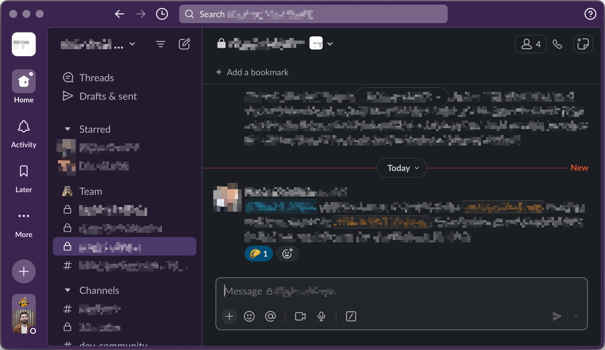

# Squirrelsong Dark Theme for [Slack](https://slack.com/)



## Installation

1. Copy the values below:

    ```
    #58406E,#A08AC2,#41635F,#CA5A83
    ```

2. Open **Preferences → Themes** in Slack.
3. Select **Dark** at the top.
4. In **Colors** section, press **Create a custom theme** if you never created a custom theme.
5. Paste the colors you copied from the previous step in the text field.
