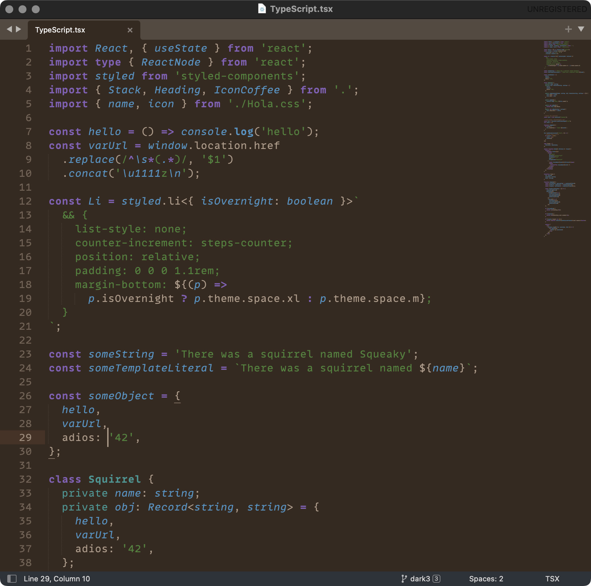

# Squirrelsong Dark Theme for [Sublime Text](https://www.sublimetext.com/)

## Installation from GitHub

1. Clone the repository or [download as a ZIP archive](https://github.com/sapegin/squirrelsong/archive/refs/heads/master.zip).
2. Unzip the files.
3. Select **Sublime Text → Setting… → Browse Packages…** to open your Sublime Text packages directory.
4. Copy the `dark/Sublime Text/Squirrelsong Dark` folder into your Sublime Text packages directory.
5. Go to **Sublime Text → Setting… → Select Color Scheme…** and select the **Squirrelsong Dark** theme.
