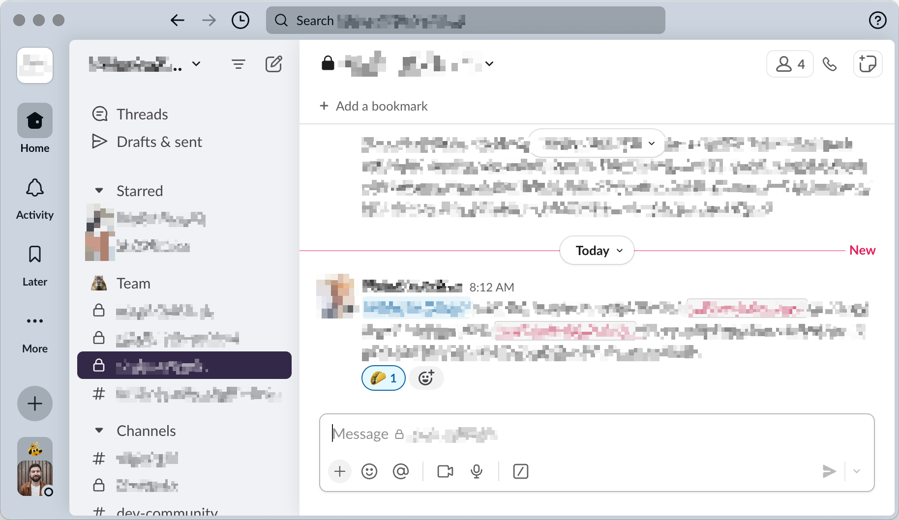

# Squirrelsong Light Theme for [Slack](https://slack.com/)



## Installation

1. Copy the values below:

    ```
    #C3CCD6,#D7CFE3,#4E7997,#AF9FC7
    ```

2. Open **Preferences → Themes** in Slack.
3. Select **Light** at the top **Color Mode** section.
4. Under the **Custom theme** tab, in **Theme colors** section, click on **↑ Import**.
5. Paste the colors you copied from the previous step in the text field.
