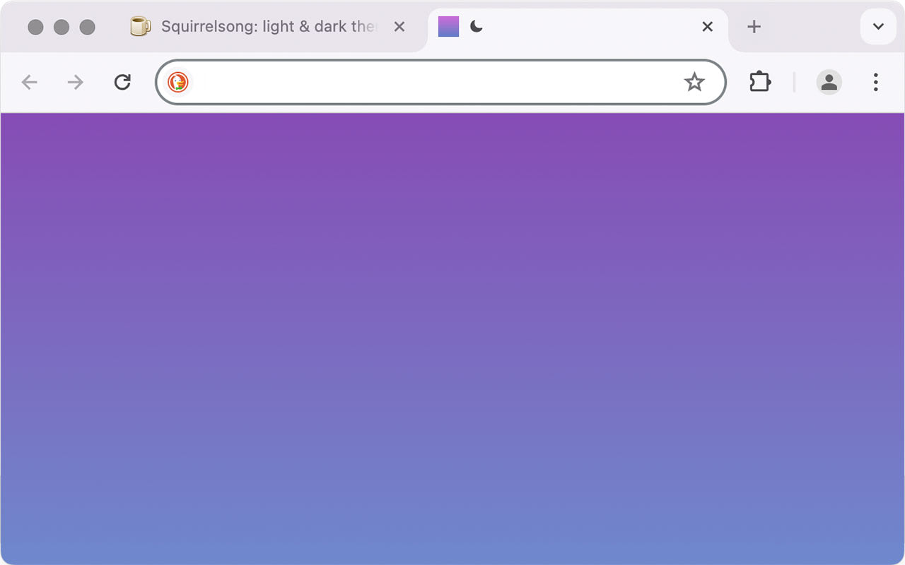
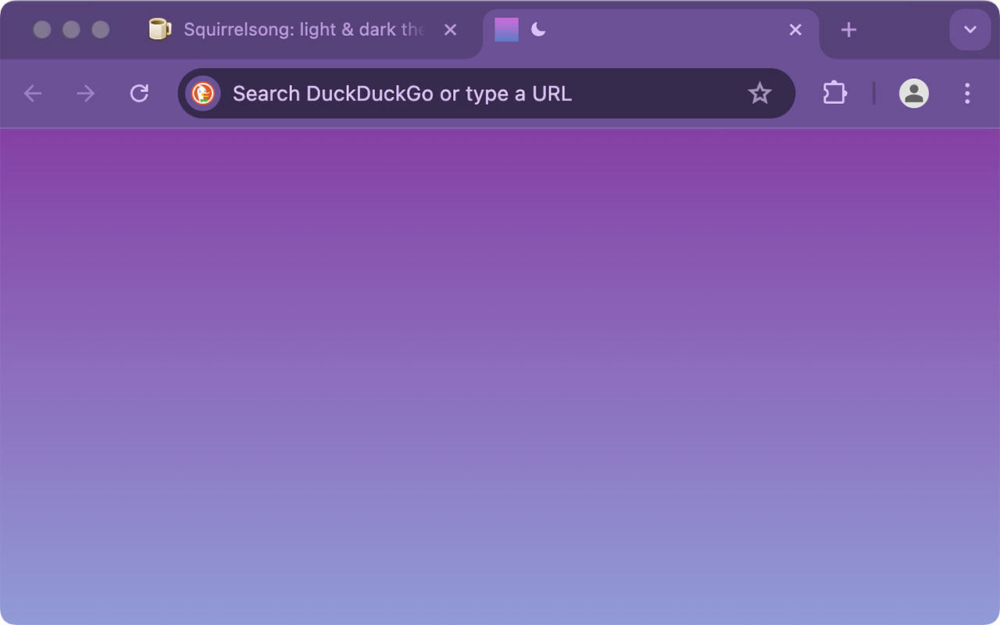

# Squirrelsong Light and Dark Themes for [Google Chrome](https://www.google.com/chrome/)

Also works for Microsoft Edge, Brave.

## Installation from Chrome Web Store

Follow the instructions: [light theme](https://chrome.google.com/webstore/detail/squirrelsong-light-theme/djifnfnaealajnoccbifhbgmkholgljn), [dark theme](https://chromewebstore.google.com/detail/squirrelsong-dark-deep-pu/oimeikpbfflafafdppijokbhhldplimj).

## Installation from GitHub

1. Clone the repository or [download as a ZIP archive](https://github.com/sapegin/squirrelsong/archive/refs/heads/master.zip).
2. Unzip the files.
3. Go to [chrome://extensions](chrome://extensions) in your browser.
4. Turn on **Developer mode**.
5. Press **Load unpacked** button.
6. Select the `themes/Chrome/extension-light` or `themes/Chrome/extension-dark` folder.
7. Activate the theme in [chrome://settings/appearance](chrome://settings/appearance) if wasn’t not activated automatically.
