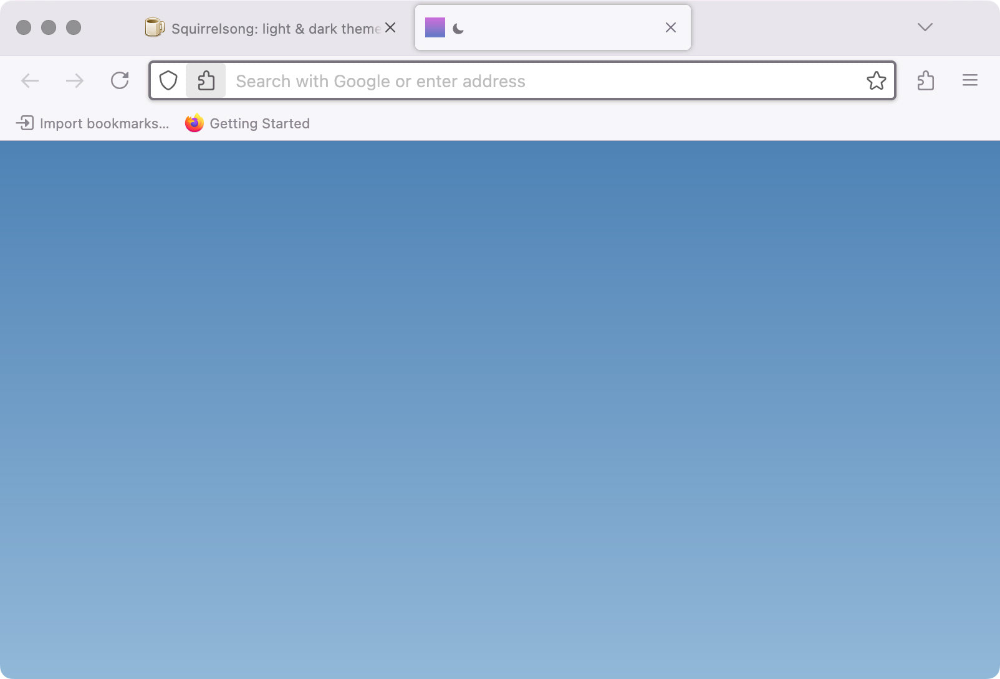

# Squirrelsong Light for [Firefox](https://www.mozilla.org/en-US/firefox/)

## Installation from Firefox Add-ons Marketplace

[Follow the instructions](https://addons.mozilla.org/addon/squirrelsong-light/).

## Installation from GitHub

1. Clone the repository or [download as a ZIP archive](https://github.com/sapegin/squirrelsong/archive/refs/heads/master.zip).
2. Install dependencies: `npm install`.
3. Build extensions: `npm run prepare-extensions`.
4. Unzip the files.
5. Go to [about:addons](about:addons) in your browser.
6. Select **Themes** in the sidebar.
7. Press the cog icon in the top right corner, and select **Install Add-on From File...**.
8. Select the `dist/firefox-light.zip`.
