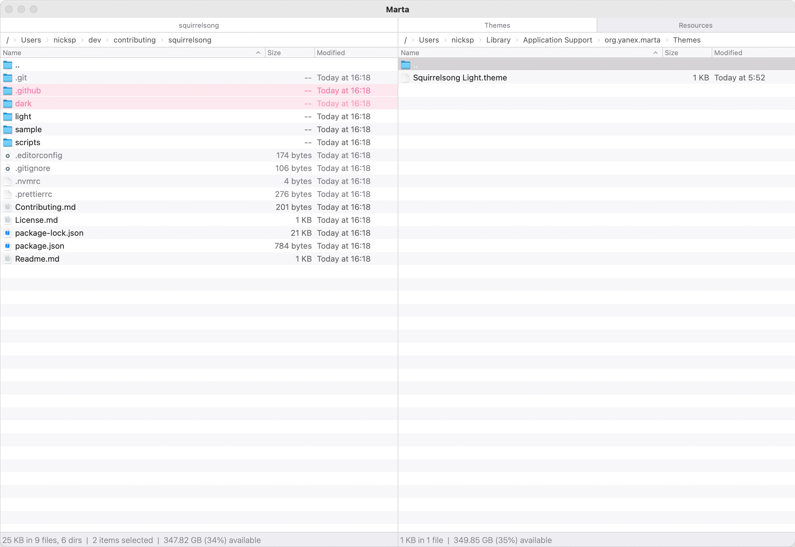

# Squirrelsong Light Theme for [Marta File Manager](https://marta.sh/)



## Installation from GitHub

1. Download [`Squirrelsong Light.theme`](Squirrelsong%20Light.theme) and put it to `~/Library/Application Support/org.yanex.marta/Themes`.
2. Download [`SquirrelsongLight.ettyTheme`](SquirrelsongLight.ettyTheme) and put it to `/Applications/Marta.app/Contents/Resources/Themes`.
3. Open **Preferences** and add the following configuration to point to the new theme:

   ```sh
   behavior {
       theme "Squirrelsong Light"
   }

   etty {
       theme "SquirrelsongLight"

       fonts {
           normal [ "MonoLisa" 15 ]
       }
   }
   ```

4. Restart the app for the changes to take effect.

> [!NOTE]
> Please note that the embedded terminal doesn’t seem to take some of the configuration colors into effect for some reason and uses system accent color instead of the configured one.
