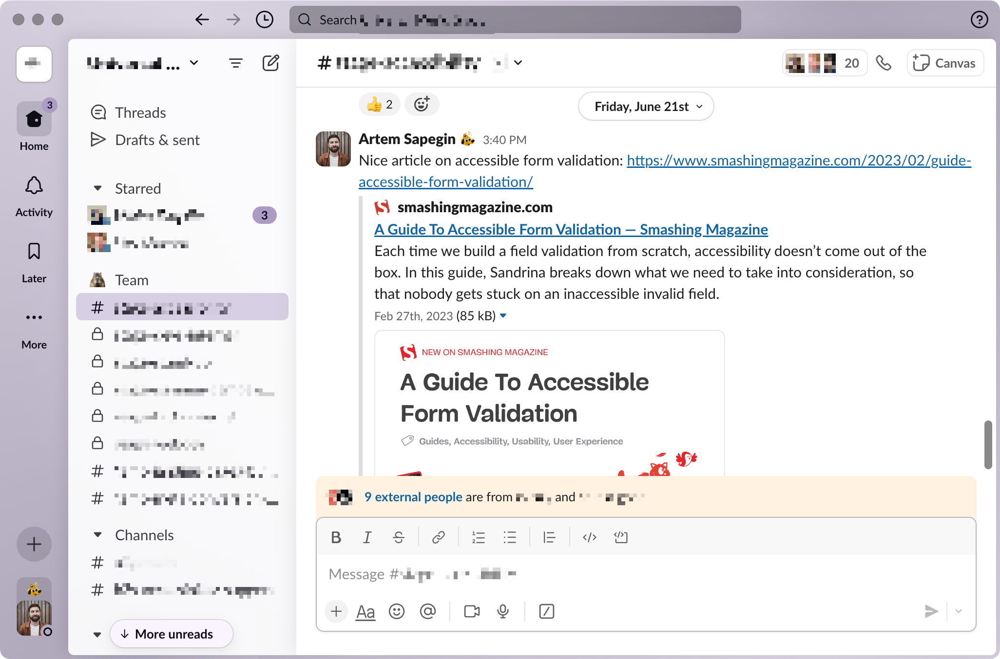
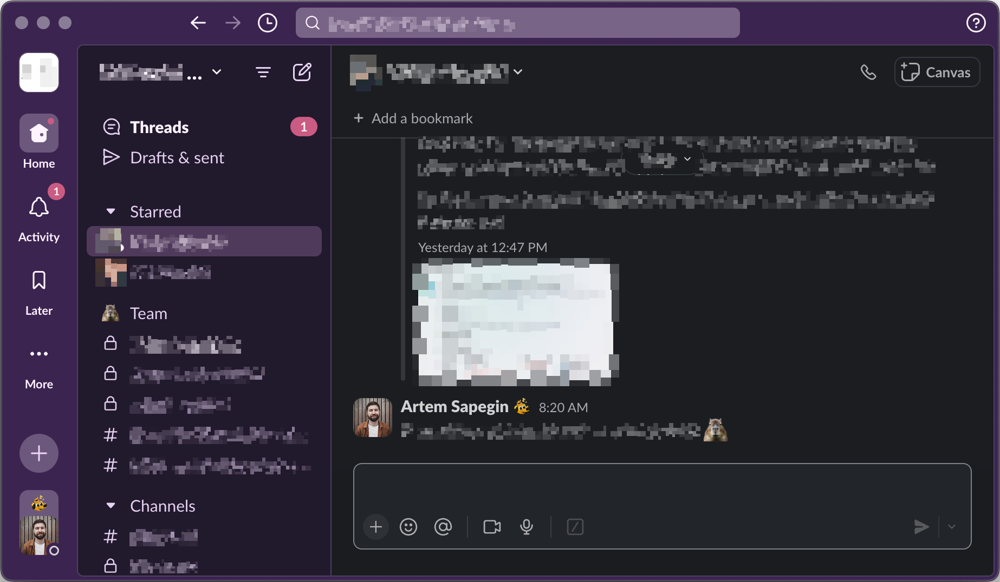

# Squirrelsong Light and Dark Deep Purple Themes for [Slack](https://slack.com/)





## Installation

1. Copy the values below for the light theme:

   ```
   #D2CCDB,#D7CFE3,#527B98,#AC9BC5
   ```

   Or these values for the dark theme:

   ```
   #57427a,#453461,#41635F,#CA5A83
   ```

2. Open **Preferences → Themes** in Slack.
3. Select **Light** or **Dark** at the top **Color Mode** section.
4. Under the **Custom theme** tab, in **Theme colors** section, click on **↑ Import**.
5. Paste the colors you copied from the previous step in the text field.
