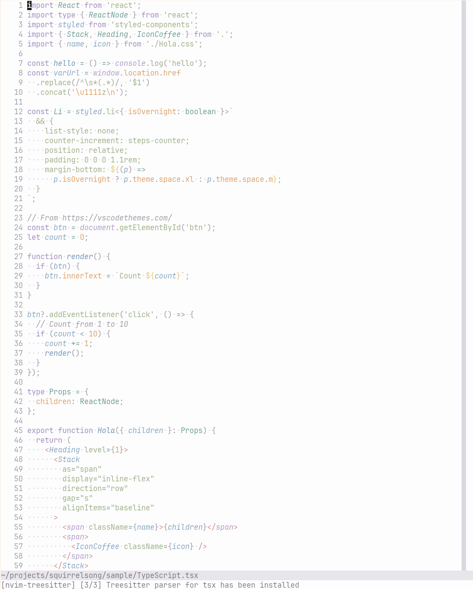

# Squirrelsong Light Theme for [Vim](https://www.vim.org)

Also works in: [Neovim](https://neovim.io).



In your Vim configuration, use `:colorscheme squirrelsong_light`.

Set `g:squirrelsong_color_only` to `v:true` beforehand to disable additional styling like italic, bold, etc. This can help on some terminals and fonts that don't support them that well.

## Installation with [lazy.nvim](https://github.com/folke/lazy.nvim)

```lua
{
  "sapegin/squirrelsong",
  config = function(plugin)
    vim.opt.rtp:append(plugin.dir .. "/themes/Vim")
  end,
}
```

## Installation with [packer.nvim](https://github.com/wbthomason/packer.nvim)

```lua
use { 'sapegin/squirrelsong', rtp = 'themes/Vim' }
```

## Installation with [vim-plug](https://github.com/junegunn/vim-plug)

```vim
call plug#begin()
  ...
  Plug 'sapegin/squirrelsong', { 'rtp': 'themes/Vim' }
  ...
call plug#end()
```

## Installation from GitHub

Put [`squirrelsong_light.vim`](colors/squirrelsong_light.vim) in the `colors` directory somewhere on your `'rtp'`. `:echo &rtp` will print your `'rtp'`.
