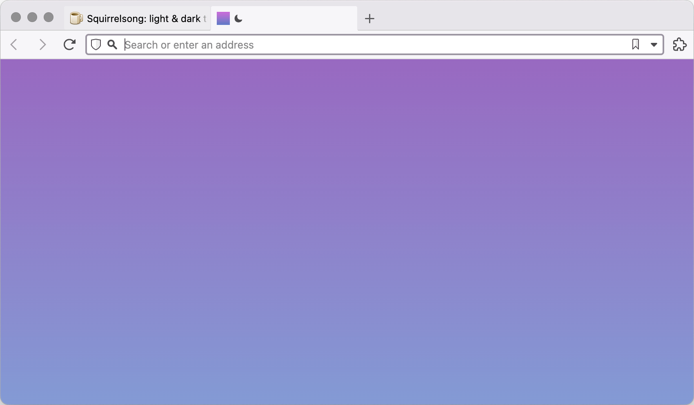

# Squirrelsong Light Theme for [Vivaldi](https://vivaldi.com)

## Installation from Vivaldi Themes

[Follow the instructions](https://themes.vivaldi.net/themes/zrnvL6V67L4)

## Installation from GitHub

1. Download [Squirrelsong Light.zip](Squirrelsong%20Light.zip).
2. Open **Settings**, then **Themes**.
3. Press **Open Theme...** button.
4. Select `Squirrelsong Light.zip`.
5. Select **Squirrelsong Light** in **Theme** list.
