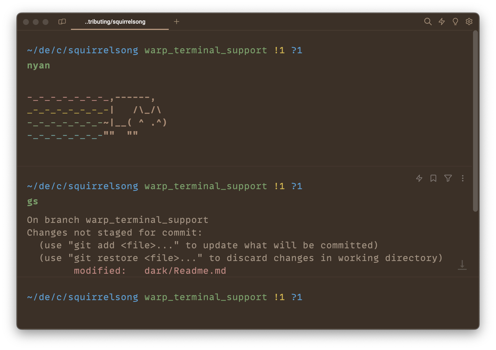

# Squirrelsong Dark Theme for [Warp](https://www.warp.dev)

## Installation from GitHub

1. To start, create the following directory: `mkdir -p ~/.warp/themes/`.

> [!NOTE]
> It may take several minutes for Warp to initially discover the new themes directory. You can either wait or restart Warp.

2. Add theme [yaml file](./squirrelsong_dark.yaml) to this directory.
3. Open **Settings**, then **Appearance**.
4. Press **Current theme** box under **Themes** section.
5. Select **Squirrelsong Dark** in **Themes** list.
