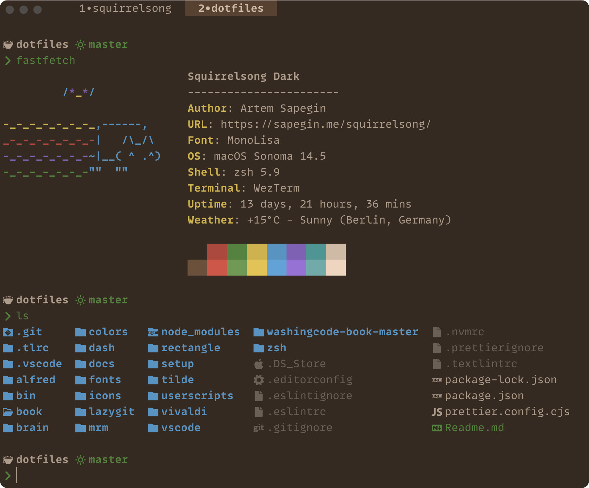

# Squirrelsong Dark Theme for [WezTerm](https://wezfurlong.org/wezterm/)



## Installation from GitHub

1. Copy the [squirrelsong-dark.toml](squirrelsong-dark.toml) to `~/.config/wezterm/colors`.

2. Update your WezTerm config, `~/.wezterm.lua`, so it looks something like this:

```lua
local wezterm = require 'wezterm'
local config = wezterm.config_builder()

-- Colors
config.color_scheme = 'Squirrelsong Dark'

config.window_frame = {
	-- Fancy tab bar
	active_titlebar_bg = '#574131',
	inactive_titlebar_bg = '#352a21',
}

-- Command Palette
config.command_palette_bg_color = "#44382D"
config.command_palette_fg_color = "#cfbaa5"

return config
```
